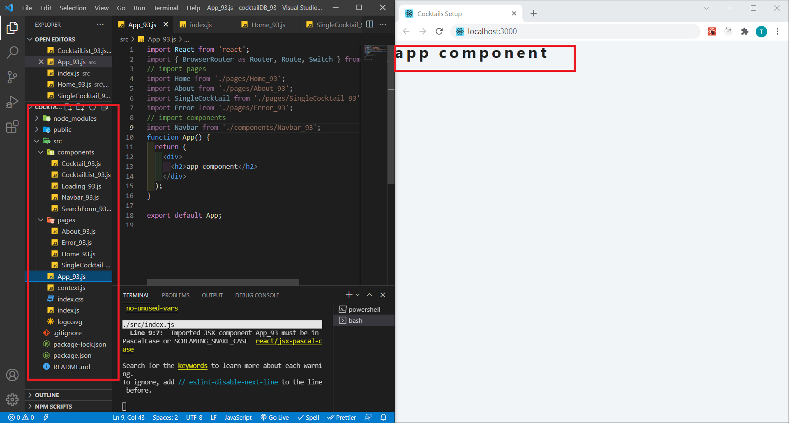
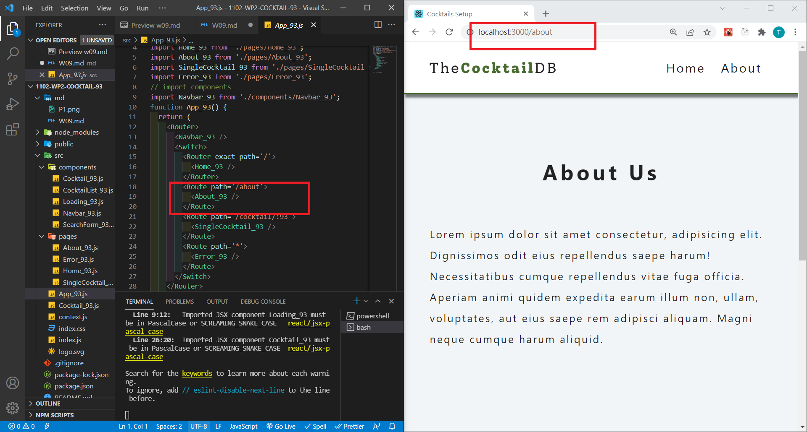
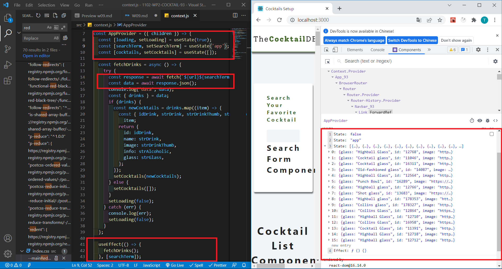
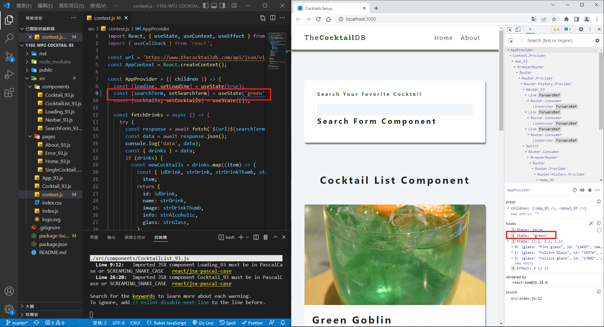
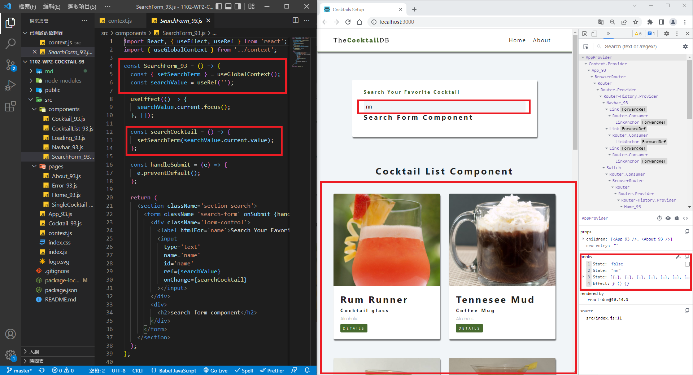

### P1 : Initial setup, change component name by adding xx

### P2 : <About_xx /> <Error_xx /> <Navbar_xx />

### P3 : Finish context.js and fetch data shown in DevTools

### P4 : Show Cocktails with your own searchTerm

### P5 : Show Cocktails using searchTerm

### P6 : All log message in Github

